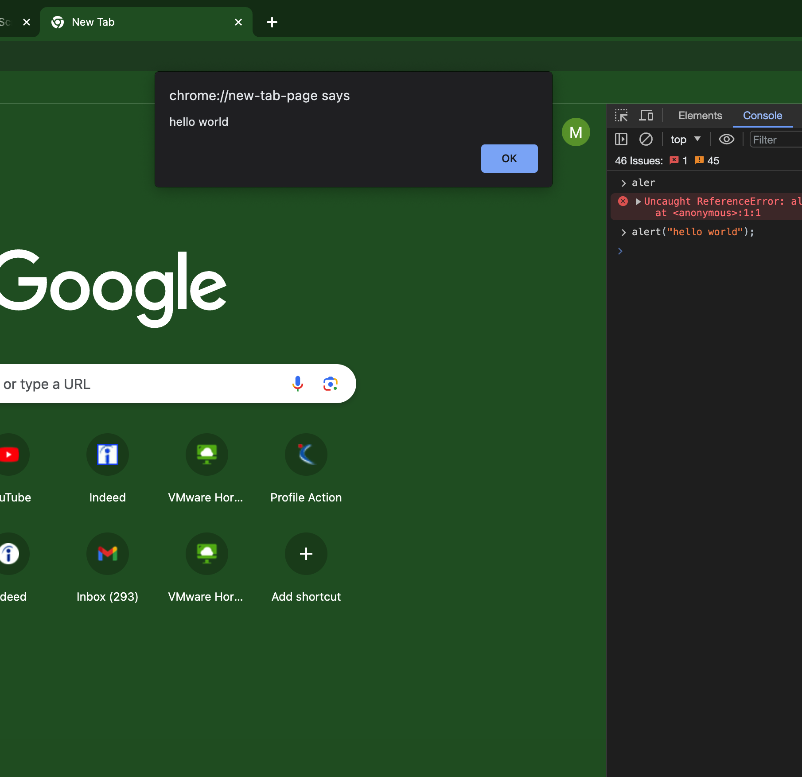
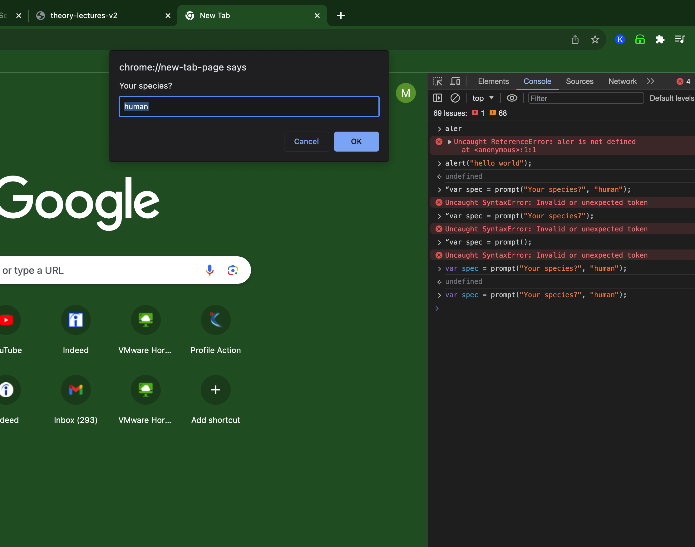

#chrome developer tools
go to console

### Alert

type alert("hello world");

### Prompt:

var spec = prompt("Your species?", "human");

# variables, if else, for loop , switch completed

# Arrays:

- var cities = ["Atlanta", "Baltimore", "Chicago", "Denver", "Los Angeles", "Seattle"];
  alert("Welcome to " + cities[3])

prints "Welcome to Denver".

- var mixedArray = [1, "Bob", "Now is", true];
  it can also have mixed values/items

- Adding or removing elements:

  i. method one:
   - pets[0] = "dog";
   - pets[1] = "cat";
   - pets[2] = "bird";

 ii. method two:
   - pets.push("fish", "ferret"); adds elements at the end
   - pets.unshift("fish1","ferret1") - adds elements at the begining

iii. removing element:
   - pets.pop() - removes last element
   - pets.shift() - removes first element

 

